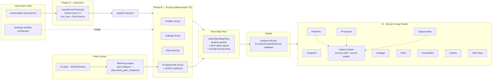
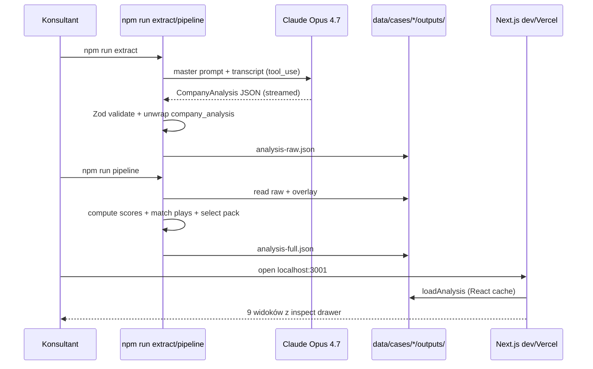
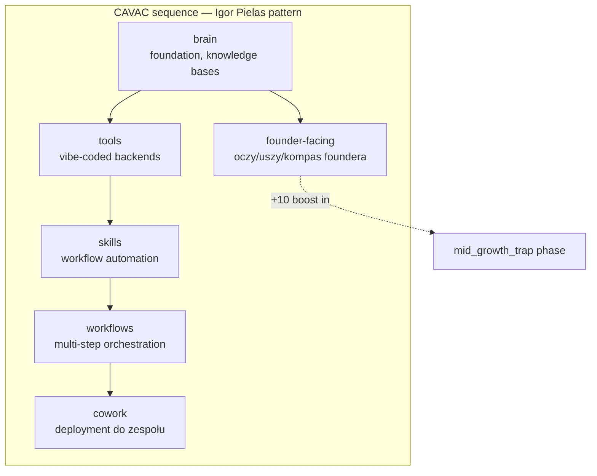
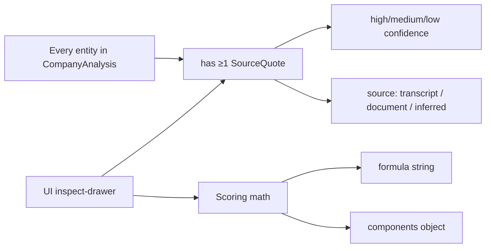

# HyperHuman Company Brain — Architecture

## High-level system



## Data flow per case



## CAVAC layers in plays library



## Scoring math at a glance

| Score | Formula | Range |
|---|---|---|
| **Problem** | `freq × sev × strat × emotional × coverage_bonus × 100` | 0–100 (clamped) |
| **Leakage** | `estimated_monthly_leak × recoverability_rate × log10 scaler` | 0–100, cap 500k PLN/mo |
| **Risk severity** | `prob × impact × horizon × mitigation × 100` | 0–100 |
| **AI opportunity** | `0.3·BI + 0.15·AI fit + 0.25·CAVAC + 0.15·Ease + 0.15·Data` | 0–100 (+10 for founder-facing in mid_growth_trap) |

## Anti-hallucination contract



Każda liczba w UI jest **klikalna** — pokazuje formula + raw components + raw quotes z confidence. Konsultant w demo może rozwinąć dowolną decyzję do source-of-truth w transkrypcie.

## Repo layout

```
lib/
  schemas/         — Zod (CompanyAnalysisSchema, AIPlaySchema, ...) · single source of truth
  extraction/      — Phase A (LLM tool_use + Zod validate)
  scoring/         — deterministic TS · problem/leakage/risk/opportunity
  plays/           — 21 plays library + matching + selection
  storage/         — server-side analysis loader (React cache)
app/
  page.tsx         — redirect → /snapshot
  layout.tsx       — root (dark mode)
  (views)/
    snapshot/      — hero diagnoza + metrics
    problems/      — sortowana tabela z inspect math
    processes/     — CAVAC bars per proces
    leakage/       — recoverable PLN/mo z assumptions
    risks/         — 2×2 quadrant + listing
    opportunities/ — top 15 plays z CAVAC sub-scores
    competitive/   — 5-dim positioning
    actions/       — Kanban preview (P-021 placeholder)
    next-step/     — Pack hero + Layer 2 sneak peek
components/
  layout/AppShell.tsx
  shared/InspectDrawer.tsx · ScoreBar.tsx · ComingSoonStub.tsx
  ui/              — shadcn (button/card/badge/tabs/table/sheet/dialog)
scripts/
  test-extract.ts        — npm run extract
  test-full-pipeline.ts  — npm run pipeline
  screenshot-views.ts    — npm run screenshots
data/cases/stock-hurt/
  inputs/conversation-transcript.txt
  inputs/strategic-briefing-overlay.json
  outputs/analysis-raw.json
  outputs/analysis-full.json
  debug/screenshots/*.png
  debug/founder-identification.md
```
