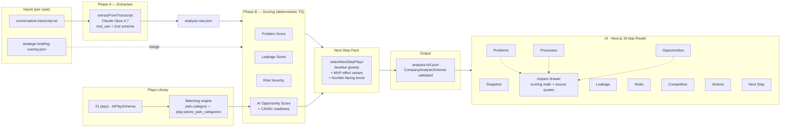
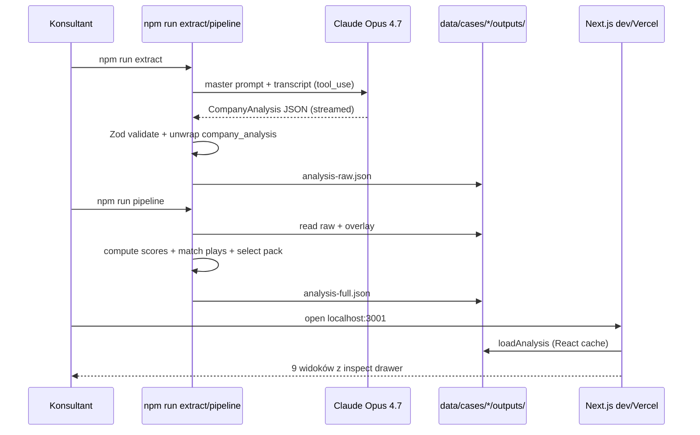
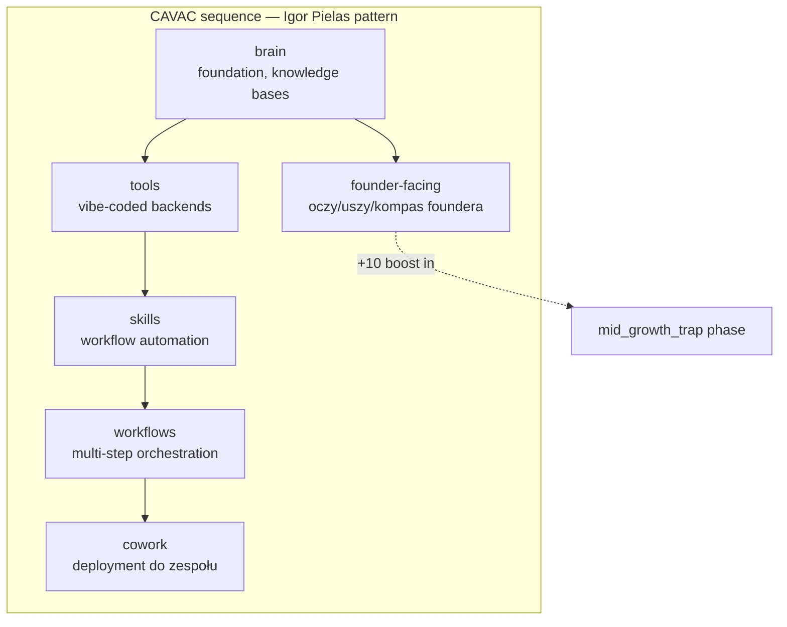
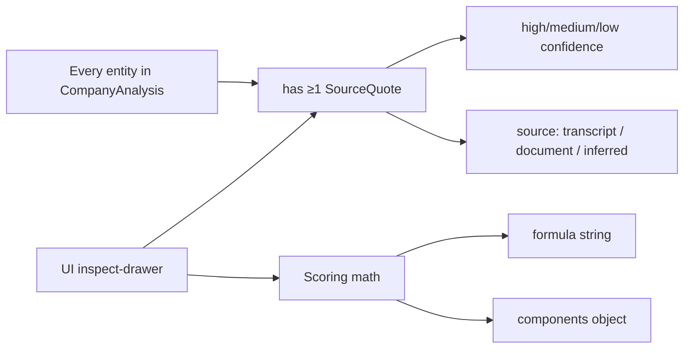

# HyperHuman Company Brain — Architecture

> **v0.2 status**: na branchu `feature/stock-hurt-v0.2` dochodzą Phase A′ (daily
> ingestion), review queue, chat-over-brain, weekly founder briefing, **MCP
> server** wystawiający mózg jako tool surface dla agentów, **LLM-driven
> ekstrakcja** daily notes i **multi-case** (HyperHuman jako case 2 — dogfood).
> Sekcje oznaczone *(v0.2)* opisują warstwę, która jeszcze nie weszła do `main`.

## High-level system



## Phase A′ — Daily Ingestion *(v0.2)*

Wizja HyperHuman: pracownicy codziennie zostawiają krótką notatkę / głosówkę,
mózg się aktualizuje, manager dostaje pigułkę raportową. Bootstrap z foundera
(Phase A) zostaje fundamentem, daily updates idą przez bramkę review:

```mermaid
flowchart LR
    subgraph Employees["Zespół (klient)"]
        E1[Pracownik form/voice]
        E2[Founder voice note]
    end

    subgraph Daily["data/cases/{slug}/inputs/daily/{date}/{author}.md"]
        D[markdown z frontmatter:<br/>author_id, role, source_type,<br/>related_entities]
    end

    subgraph Ingest["npm run ingest"]
        IG[ingest-daily.ts<br/>parse frontmatter +<br/>classify entity_type]
    end

    subgraph Queue["data/cases/{slug}/outputs/pending-queue.json"]
        PE[PendingEntity[]<br/>review.status = 'pending']
    end

    subgraph Review["UI · /review"]
        UI[Manager / dev przegląda<br/>approve → mózg<br/>reject → out]
    end

    subgraph Brain["analysis-full.json<br/>(approved entities only)"]
        AF[Phase B re-score<br/>dashboardy + chat]
    end

    E1 --> D
    E2 --> D
    D --> IG
    IG --> PE
    PE --> UI
    UI -->|approved| AF
    UI -->|rejected| X[archive]
```

Kontrakt: encje w statusie `pending` **nie istnieją** dla scoring i dashboardów.
Dopiero gdy `review.status === 'approved'` wchodzą do `analysis-full.json` przy
następnym `npm run pipeline`. Dzięki temu LLM-hallucynacja albo plotka nie
zdeformuje &bdquo;centralnego mózgu&rdquo;.

## Chat over brain *(v0.2)*

`/chat` to drugi tryb (obok dashboardów) dla mniej technicznych użytkowników z
zespołu klienta. Server-side łączy `analysis-full.json` w **compact RAG context**
(pains + risks + processes + top plays + ich source_quotes), wstrzykuje to do
system prompta Claude Opus 4.7 z trzema twardymi zasadami:

1. każde twierdzenie z dosłownym cytatem z kontekstu,
2. inline reference do chunk ID (`[pain-founder-detachment]`),
3. eksplicytne &bdquo;nie mam tej informacji w mózgu firmy&rdquo; gdy kontekst nie pokrywa pytania.

Ten sam anty-halucynacyjny kontrakt co inspect drawer — tylko że w naturalnym
formacie czatu.

## Weekly Founder Briefing *(v0.2)*

`npm run briefing -- --case stock-hurt --since 2026-05-16` produkuje markdown
digest składający: nowe pending entities, top 5 painów po score, imminent risks,
status next-step pack i 3 decyzje na tydzień. Dogfood: to **dokładnie play
P-020** z naszej własnej plays library — używamy naszego produktu na samych
sobie.

## MCP server — brain jako infrastructure *(v0.2)*

`npm run mcp` startuje stdio MCP server (`@modelcontextprotocol/sdk`) wystawiający
mózg jako tool surface dla innych agentów (Claude Desktop, Claude Code, własne
workflowy). To jest core "AI System Lead" move — mózg nie jest tylko dashboardem,
jest tool-em dla agentów.

Tools exposed:
- `list_pains(case_id?, category?, min_score?)` — painy z problem_score, kategorią, count cytatów
- `list_risks(case_id?, horizon?)` — ryzyka z severity_score
- `get_play(case_id?, play_id)` — pełne details play match (BI/AI fit/ease/data/CAVAC)
- `get_source_quote(case_id?, entity_id)` — **kluczowy tool anty-halucynacyjny**: dosłowne cytaty backing-ujące encję
- `get_next_step_pack(case_id?)` — rekomendowany pakiet plays

Każdy tool wymusza ten sam anty-halucynacyjny kontrakt co reszta produktu — agent
pytający „dlaczego ten pain jest top?" musi sięgnąć po `get_source_quote` żeby
odpowiedź miała grunt.

## LLM-driven Phase A′ ekstrakcja *(v0.2)*

`npm run ingest -- --case stock-hurt --llm` używa Claude Opus 4.7 z tool_use +
Zod schema do strukturalnej ekstrakcji daily notes (zamiast regex heurystyki).
Wejście: notatka pracownika + lista istniejących encji w mózgu. Wyjście:
`PendingEntity[]` z entity_type, title, description, **dosłowny source_quote**
z notatki, confidence i `related_entity_ids` dopasowane do istniejących encji.

Krzysiek's notatka „system pokazuje 'produkt niedostępny' mimo że stock jest
na hali" automatycznie wpada jako entity_type=pain z `related_entity_ids:
['pain-tools-fragmentation', 'proc-allegro-listing']` — bez ręcznej klasyfikacji.

## Multi-case · HyperHuman jako case 2 *(v0.2)*

`data/cases/hyperhuman/` to drugi pełny case zbudowany z mini-rozmowy z
HyperHuman o ich własnych painach (distribution gap, brak marketing skills,
product cannibalization, brak własnego brain-a). Cookie-based case switcher w
AppShell pozwala przełączać kontekst całego UI bez touchowania URL.

Cel: pokazać że produkt jest reproducible między case-ami **i** że HyperHuman
samo siedzi w tej samej pułapce, którą leczy klientom. Powstaje dogfood pack:
P-001 (brain wewnętrzny) → P-020 (founder briefing) → P-019 (market intel) →
P-015 (content distribution).

## Live brain indicator *(v0.2)*

Snapshot dostał ticker `LiveBrainTicker` pokazujący w czasie rzeczywistym:
- ostatnie scoring refresh
- ostatni daily ingest (z czasem względnym: "12h temu")
- pending queue count (linka do `/review` jeśli > 0)
- approved entities w ostatnich 7 dniach

Wizualnie destrukcja narracji „one-shot raport" — mózg ma żyć.

## Sprint 3 · Domknięcie pętli + telemetria + historia *(v0.2)*

Dziury które domykamy: (1) approve nie zmieniał `analysis-full.json`, (2) brak telemetrii pipeline-u, (3) brak historii i score deltas.

### Auto-merge approved → brain

`mergeApprovedToAnalysis(caseSlug, entityId)` w `lib/storage/load-pending.ts`:
1. Snapshot bieżącego `analysis-full.json` → `outputs/history/{ISO}.json` (audit trail).
2. Konwersja `PendingEntity` → minimalny `Pain` / `Risk` (entity_type-driven) z `source_quote` z payload-u, `source_role`/`source_type`/`author_id`/`ingested_at` z pending entity.
3. Push do `analysis.pains` / `analysis.risks`, update `last_continuous_refresh`, zapis.

Wywoływane z `app/api/review/route.ts` na każdy approve. UI feedback w `ReviewActions.tsx` pokazuje toast „dodano pain do mózgu".

### `/eval` view · telemetria

`lib/eval/metrics.ts` deterministycznie liczy z `analysis-full.json` + `pending-queue.json`:
- **Schema validation** — zielone/czerwone na każdy plik
- **Source quote coverage** — % painów/risków/procesów z ≥1 quote (target 100%)
- **Scoring distribution** — histogram problem_score po bucketach, z czerwonym ostrzeżeniem o clamp ceiling 100/100
- **Pending velocity** — total, pending now, approved 7d, approval ratio
- **Phase A′ fidelity** — dla LLM-mode pending: % wpisów których `source_quote` faktycznie występuje w `raw_input` (sprawdza czy LLM nie halucynował cytatu)
- **History** — count snapshotów + latest

### Snapshot history + score delta

`lib/storage/load-history.ts` czyta najnowszy snapshot z `outputs/history/`.
`diffScores(prev, curr)` zwraca listę zmian ≥3pkt.
- `scripts/generate-briefing.ts` dorzuca sekcję „Score deltas vs ostatni snapshot" z ↑/↓ arrows i wartościami prev → curr.
- `LiveBrainTicker` na snapshot dorzuca top-pain delta label jeśli historia istnieje.

Dzięki temu briefing pokazuje **`pain-X: 95 → 100 (+5)`** po approve nowego cytatu — mózg ma historię, nie tylko stan.

## Data flow per case



## CAVAC layers in plays library



## Scoring math at a glance

| Score | Formula | Range |
|---|---|---|
| **Problem** | `freq × sev × strat × emotional × coverage_bonus × 100` | 0–100 (clamped) |
| **Leakage** | `estimated_monthly_leak × recoverability_rate × log10 scaler` | 0–100, cap 500k PLN/mo |
| **Risk severity** | `prob × impact × horizon × mitigation × 100` | 0–100 |
| **AI opportunity** | `0.3·BI + 0.15·AI fit + 0.25·CAVAC + 0.15·Ease + 0.15·Data` | 0–100 (+10 for founder-facing in mid_growth_trap) |

## Anti-hallucination contract



Każda liczba w UI jest **klikalna** — pokazuje formula + raw components + raw quotes z confidence. Konsultant w demo może rozwinąć dowolną decyzję do source-of-truth w transkrypcie.

## Repo layout

```
lib/
  schemas/         — Zod (CompanyAnalysisSchema, AIPlaySchema, PendingEntity, ReviewMetadata, ...) · single source of truth
  extraction/      — Phase A (LLM tool_use + Zod validate)
  scoring/         — deterministic TS · problem/leakage/risk/opportunity
  plays/           — 21 plays library + matching + selection
  storage/         — server-side analysis loader (React cache) + load-pending
  chat/            — v0.2: RAG context builder dla /chat
app/
  page.tsx         — redirect → /snapshot
  layout.tsx       — root (dark mode)
  (views)/
    snapshot/      — hero diagnoza + metrics
    problems/      — sortowana tabela z inspect math
    processes/     — CAVAC bars per proces
    leakage/       — recoverable PLN/mo z assumptions
    risks/         — 2×2 quadrant + listing
    opportunities/ — top 15 plays z CAVAC sub-scores
    competitive/   — 5-dim positioning
    actions/       — Kanban preview (P-021 placeholder)
    next-step/     — Pack hero + Layer 2 sneak peek
    review/        — v0.2: kolejka pending entities z daily ingestion (approve/reject)
    chat/          — v0.2: czat nad mózgiem firmy, każda odpowiedź z inline citations
components/
  layout/AppShell.tsx
  shared/InspectDrawer.tsx · ScoreBar.tsx · ComingSoonStub.tsx
  ui/              — shadcn (button/card/badge/tabs/table/sheet/dialog)
scripts/
  test-extract.ts        — npm run extract
  test-full-pipeline.ts  — npm run pipeline
  screenshot-views.ts    — npm run screenshots
  ingest-daily.ts        — v0.2: npm run ingest (Phase A′)
  generate-briefing.ts   — v0.2: npm run briefing (weekly digest)
data/cases/stock-hurt/
  inputs/conversation-transcript.txt
  inputs/strategic-briefing-overlay.json
  inputs/daily/                       — v0.2: {YYYY-MM-DD}/{author}.md frontmatter + body
  outputs/analysis-raw.json
  outputs/analysis-full.json
  outputs/pending-queue.json          — v0.2: PendingEntity[] z statusem review
  outputs/briefings/                  — v0.2: markdown briefings z weekly digest
  debug/screenshots/*.png
  debug/founder-identification.md
```
